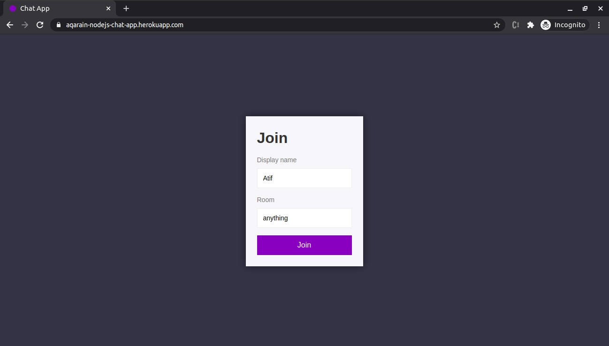
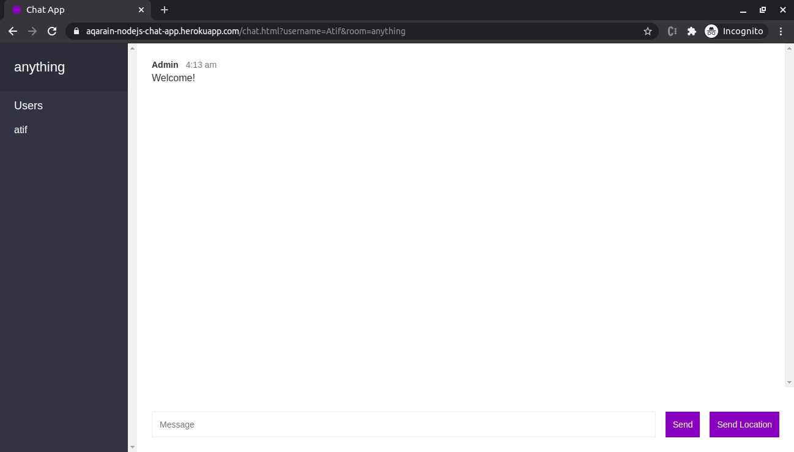

# NodeJS Chat App

## Description yet to be updated

This project is part of my self-learning

The app is deployed on Heroku and can be accessed via https://aqarain-nodejs-chat-app.herokuapp.com/

The tutorial followed for this is: The Complete Node.js Developer Course (3rd Edition) by Andrew Mead, Rob Percival (https://www.udemy.com/course/the-complete-nodejs-developer-course-2)

## Screenshots:

